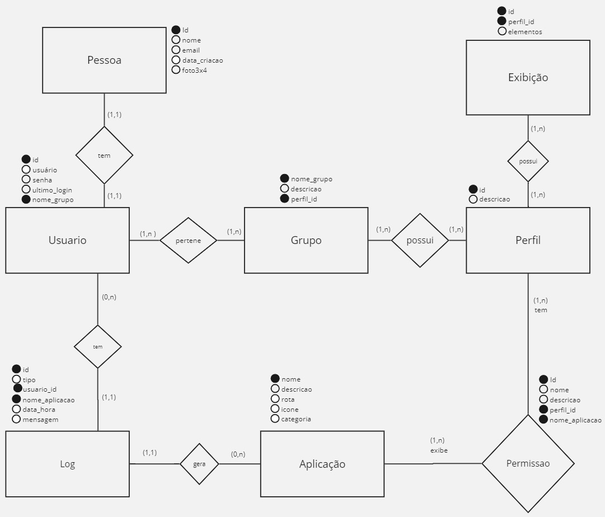
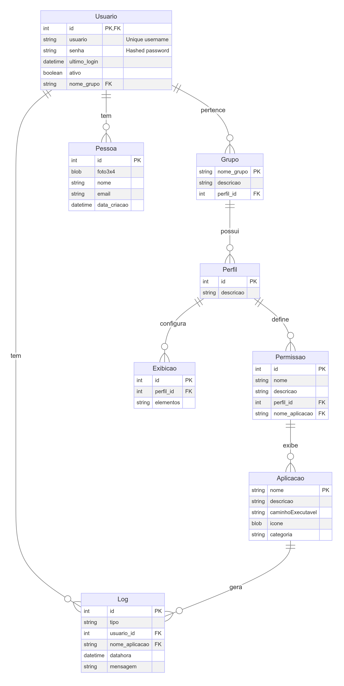

# Estrutura do Banco Intranet

## Banco

Entidades

## Entidades:

### Grupo
- **nome_grupo**: Nome do grupo e identificador único.
- **descricao**: Descrição do grupo.
- **perfil_id**: Chave estrangeira para a tabela Perfil.

### Pessoa
- **id**: Identificador único da pessoa.
- **foto3x4**: Foto da pessoa (BLOB).
- **nome**: Nome completo do usuário.
- **email**: Endereço de email do usuário.
- **data_criacao**: Data de criação da conta.

### Usuario
- **id**: Identificador único do usuário (referência à tabela Pessoa).
- **usuario**: Nome de usuário (único).
- **senha**: Senha do usuário (armazenada de forma segura, e.g., hash).
- **ultimo_login**: Data e hora do último login.
- **ativo**: Indicador se a conta está ativa.
- **nome_grupo**: Chave estrangeira para a tabela Grupo.

### Aplicacao
- **nome**: Nome da aplicação e identificador único.
- **descricao**: Descrição da aplicação.
- **caminhoExecutavel**: Caminho do executável na rede.
- **icone**: Ícone da aplicação (BLOB).
- **categoria**: Categoria da aplicação (coluna, flag, ou enumerador).

### Permissao
- **id**: Identificador único da permissão.
- **nome**: Nome da permissão.
- **descricao**: Descrição da permissão.
- **perfil_id**: Chave estrangeira para a tabela Perfil.
- **nome_aplicacao**: Chave estrangeira para a tabela Aplicacao.

### Log
- **id**: Identificador único do log.
- **tipo**: Nome do tipo do log.
- **usuario_id**: Chave estrangeira para a tabela Usuario.
- **nome_aplicacao**: Chave estrangeira para a tabela Aplicacao.
- **datahora**: Data e hora do log.
- **mensagem**: Mensagem do log.

### Perfil
- **id**: Identificador único do perfil.
- **descricao**: Descrição do perfil.

### Exibicao
- **id**: Identificador único da exibição.
- **perfil_id**: Chave estrangeira para a tabela Perfil.
- **elementos**: Identificadores de elementos específicos da página (ex: botões, ações).

Relacionamentos

## Relacionamentos

### 1. Grupo e Perfil
- **Descrição**: Um grupo está associado a um perfil específico. Um perfil pode ser compartilhado entre vários grupos.
- **Cardinalidade**:
  - **Grupo (1, N) — (1, 1) Perfil**: Cada grupo deve ter exatamente um perfil, e um perfil pode estar associado a vários grupos ou nenhum.
  - **Perfil (0, N) — (1, 1) Grupo**: Cada perfil pode estar associado a zero ou mais grupos.

### 2. Perfil e Permissao
- **Descrição**: Cada perfil pode ter várias permissões associadas a diferentes aplicações. Cada permissão está associada a um único perfil.
- **Cardinalidade**:
   - **Perfil (1, N) — (1, N) Permissão**: Um perfil pode ter várias permissões.
   - **Permissão (1, N) — (1, 1) Perfil**: Uma permissão está associada a exatamente um perfil.

### 3. Aplicacao e Permissao
- **Descrição**: Cada aplicação pode ter várias permissões associadas a diferentes perfis. Cada permissão está associada a uma única aplicação.
- **Cardinalidade**:
   - **Aplicação (1, N) — (1, N) Permissão**: Uma aplicação pode ter várias permissõe.
   - **Permissão (1, N) — (1, N) Aplicação**: Uma permissão pode conceder acesso a várias aplicações.

#### Exemplo Ilustrativo

- **Perfil**: "Administrador"
  - Pode ter as seguintes permissões:
    - **Permissão A**: Acesso total à aplicação X e Y.
    - **Permissão B**: Acesso parcial à aplicação Z.

- **Aplicação**: 
  - **Aplicação X**: Pode ser acessada por "Permissão A".
  - **Aplicação Y**: Pode ser acessada por "Permissão A".
  - **Aplicação Z**: Pode ser acessada por "Permissão B".

### 4. Perfil e Exibicao
- **Descrição:** Define quais elementos de uma página são visíveis para um perfil específico. Cada exibição está associada a um único perfil, mas um perfil pode estar associado a várias exibições.
- **Cardinalidade:**
    - **Perfil (1, N) — (1, N) Exibicao:** Cada perfil pode ter zero ou mais exibições.
    - **Exibicao (1, N) — (1, N) Perfil:** Cada exibição pode estar associada a mais de um perfil.

### 5. Pessoa e Usuario
- **Descrição**: Cada pessoa tem um usuário associado para login. Cada usuário é vinculado a uma única pessoa.
- **Cardinalidade**:
  - **Pessoa (1, 1) — (1, 1) Usuario**: Cada pessoa possui exatamente um usuário associado.
  - **Usuario (1, 1) — (1, 1) Pessoa**: Cada usuário está vinculado a uma única pessoa.

### 6. Grupo e Usuario
- **Descrição**: Cada usuário pertence a um grupo, que define suas permissões gerais. Um grupo pode ter vários usuários.
- **Cardinalidade**:
  - **Grupo (0, N) — (1, 1) Usuario**: Um grupo pode ter zero ou mais usuários.
  - **Usuario (1, 1) — (1, N) Grupo**: Cada usuário pertence a um único grupo.

### 7. Usuario e Log
- **Descrição**: Cada usuário pode gerar múltiplos logs. Cada log é associado a um único usuário.
- **Cardinalidade**:
  - **Usuario (0, N) — (1, 1) Log**: Um usuário pode gerar zero ou mais logs.
  - **Log (1, 1) — (1, N) Usuario**: Cada log é associado a um único usuário.

### 8. Aplicacao e Log
- **Descrição**: Cada aplicação pode ter vários logs associados. Cada log está vinculado a uma única aplicação.
- **Cardinalidade**:
  - **Aplicacao (0, N) — (1, 1) Log**: Cada aplicação pode gerar zero ou mais logs.
  - **Log (1, 1) — (1, N) Aplicacao**: Cada log está associado a uma única aplicação.

Pontos Importantes

## **Pontos Importantes**

1. **Segregação de Dados**
   - **Pessoa**: Armazena informações pessoais e não críticas.
   - **Usuario**: Armazena informações de autenticação e controle de acesso.

2. **Associação de Grupos e Perfis**
   - **Grupo**: Define um conjunto de usuários e está associado a um perfil específico.
   - **Perfil**: Define as permissões e exibições específicas para grupos.

3. **Gerenciamento de Permissões e Exibições**
   - **Permissao**: Define o acesso a aplicações e páginas para um perfil.
   - **Exibicao**: Define permissões específicas de exibição de elementos na página para um perfil.

4. **Auditoria e Rastreabilidade**
   - **Log**: Registra atividades dos usuários e ações realizadas nas aplicações.

Fluxo de Login

## **Fluxo de Login**

1. **Autenticação**
   - O usuário fornece suas credenciais (nome de usuário e senha) através da tela de login.
   - O sistema verifica as credenciais fornecidas com as informações armazenadas na tabela `Usuario`.

2. **Verificação de Credenciais**
   - As credenciais são validadas contra o banco de dados.
   - Se a autenticação for bem-sucedida, o sistema recupera o perfil associado ao grupo do usuário.

3. **Recuperação do Perfil e Permissões**
   - O sistema determina o grupo do usuário e, em seguida, obtém o perfil associado a esse grupo.
   - A partir do perfil, o sistema obtém as permissões associadas (tabela `Permissao`) e as permissões de exibição (tabela `Exibicao`).

4. **Configuração do Ambiente do Usuário**
   - **Permissões de Acesso**: Configura o acesso às aplicações e páginas do sistema de acordo com as permissões do perfil.
   - **Permissões de Exibição**: Configura quais elementos (como botões e ações) são visíveis nas páginas com base nas permissões de exibição do perfil.

5. **Registro de Atividade**
   - O sistema gera logs para registrar a atividade de login, associando-a ao usuário e à aplicação em que a atividade ocorreu.

## Diagrama

Tabelas

## Tabelas

### Grupo
- `nome_grupo` : VARCHAR(255), PRIMARY KEY
- `descricao` : TEXT
- `perfil_id` : INT, FOREIGN KEY (referência à tabela Perfil)

### Pessoa
- `id` : INT, PRIMARY KEY, AUTO_INCREMENT
- `foto3x4` : BLOB
- `nome` : VARCHAR(255)
- `email` : VARCHAR(255)
- `data_criacao` : DATETIME

### Usuario
- `id` : INT, PRIMARY KEY, AUTO_INCREMENT, FOREIGN KEY (referência à tabela Pessoa)
- `usuario` : VARCHAR(255), UNIQUE
- `senha` : VARCHAR(255)  // Armazenar como hash seguro
- `ultimo_login` : DATETIME
- `nome_grupo` : VARCHAR(255), FOREIGN KEY (referência à tabela Grupo)

### Aplicacao
- `nome` : VARCHAR(255), PRIMARY KEY
- `descricao` : TEXT
- `caminhoExecutavel` : VARCHAR(500)
- `icone` : BLOB
- `categoria` : VARCHAR(255) // Pode ser uma coluna, flag, ou enumerador

### Permissao
- `id` : INT, PRIMARY KEY, AUTO_INCREMENT
- `nome` : VARCHAR(255)
- `descricao` : TEXT
- `perfil_id` : INT, FOREIGN KEY (referência à tabela Perfil)
- `nome_aplicacao` : VARCHAR(255), FOREIGN KEY (referência à tabela Aplicacao)

### Log
- `id` : INT, PRIMARY KEY, AUTO_INCREMENT
- `tipo` : VARCHAR(255)
- `usuario_id` : INT, FOREIGN KEY (referência à tabela Usuario)
- `nome_aplicacao` : VARCHAR(255), FOREIGN KEY (referência à tabela Aplicacao)
- `datahora` : DATETIME
- `mensagem` : TEXT

### Perfil
- `id` : INT, PRIMARY KEY, AUTO_INCREMENT
- `descricao` : TEXT

### Exibicao
- `id` : INT, PRIMARY KEY, AUTO_INCREMENT
- `perfil_id` : INT, FOREIGN KEY (referência à tabela Perfil)
- `elementos` : TEXT // Pode conter identificadores de elementos específicos da página (ex: botões, ações)

Normalização do banco

## Normalização do banco
EM CONSTRUÇÃO

