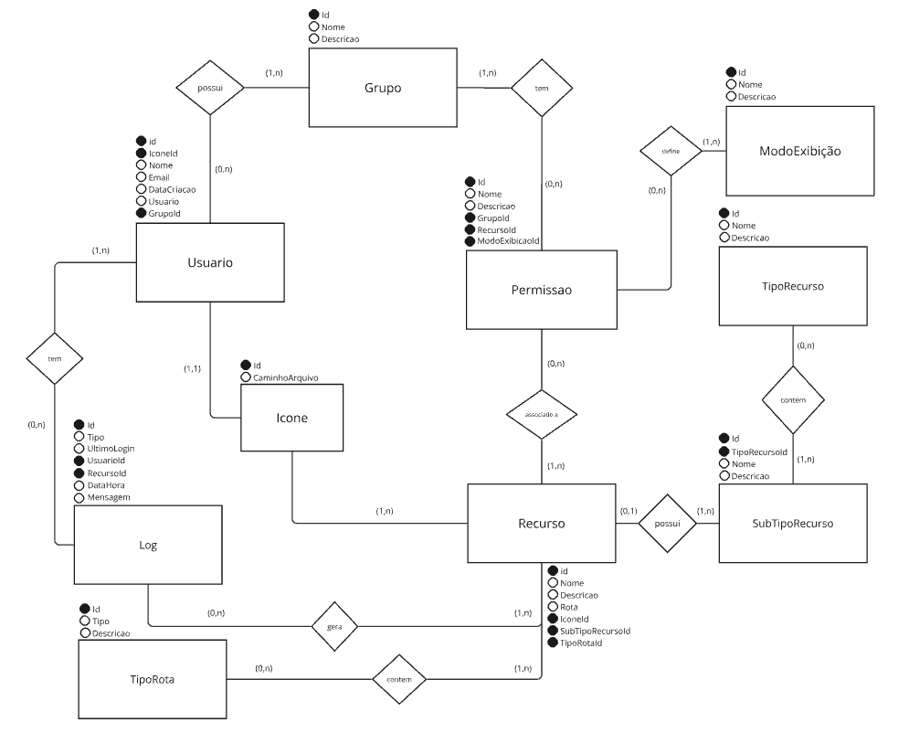
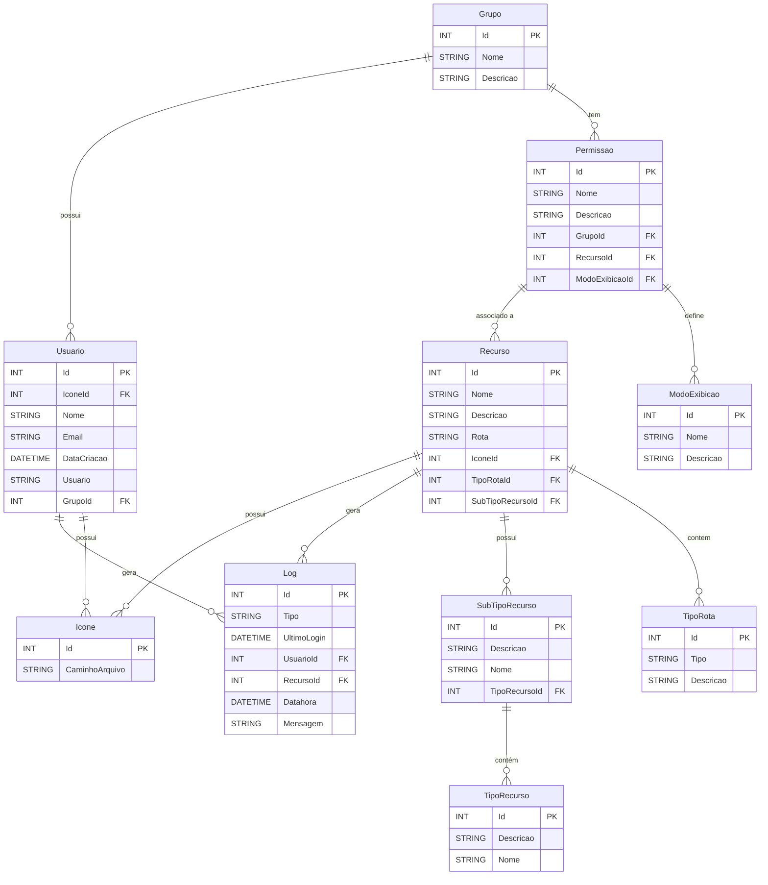
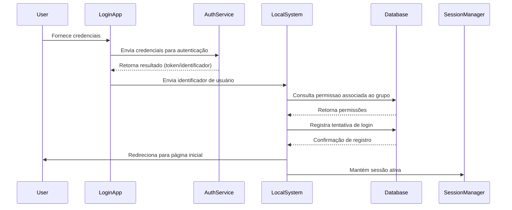

# Estrutura do Banco Intranet

## Banco

Entidades

## Entidades:

1. **Grupo**
   - **Id**: Identificador único.
   - **Nome**: Nome do grupo.
   - **Descricao**: Descrição do grupo.

2. **Usuario**
   - **Id**: Identificador único.
   - **IconeId**: Chave estrangeira para a tabela `Icone`.
   - **Nome**: Nome completo do usuário.
   - **Email**: Endereço de email do usuário.
   - **DataCriacao**: Data de criação da conta.
   - **Usuario**: Nome de usuário (único).
   - **GrupoId**: Chave estrangeira para a tabela `Grupo`.

3. **Icone**
   - **Id**: Identificador único.
   - **CaminhoArquivo**: Foto do usuário ou ícone do recurso.

4. **Recurso**
   - **Id**: Identificador único.
   - **Nome**: Nome do recurso.
   - **Descricao**: Descrição do recurso.
   - **Rota**: Caminho do recurso na rede.
   - **TipoRotaId**: Chave estrangeira para a tabela `Tipo Rota`
   - **IconeId**: Chave estrangeira para a tabela `Icone`.
   - **SubTipoRecursoId**: Chave estrangeira para a tabela `SubTipoRecurso`.

5. **SubTipoRecurso**
   - **Id**: Identificador único.
   - **Nome**: Nome do tipo de recurso.
   - **Descricao**: Descrição do tipo de recurso.
   - **TipoRecursoId**: Chave estrangeira para a tabela `TipoRecurso`.

6. **TipoRecurso**
   - **Id**: Identificador único.
   - **Descricao**: Descrição do tipo de recurso.
   - **Nome**: Nome do tipo de recurso.

7. **Log**
   - **Id**: Identificador único.
   - **Tipo**: Tipo do log.
   - **UltimoLogin**: Data e hora do último login.
   - **UsuarioId**: Chave estrangeira para a tabela `Usuario`.
   - **RecursoId**: Chave estrangeira para a tabela `Recurso`.
   - **Datahora**: Data e hora do log.
   - **Mensagem**: Mensagem do log.

8. **Permissao**
   - **Id**: Identificador único.
   - **Nome**: Nome da permissão. Pode representar um tipo ou nome descritivo.
   - **Descricao**: Descrição da permissão.
   - **GrupoId**: Chave estrangeira para a tabela `Grupo`.
   - **RecursoId**: Chave estrangeira para a tabela `Recurso`.
   - **ModoExibicaoId**: Chave estrangeira para a tabela `ModoExibicao`.

9. **ModoExibicao**
   - **Id**: Identificador único.
   - **Nome**: Nome da exibição.
   - **Descricao**: descrição da exibição.

10. **TipoRota**
   - **Id**: Identificador único.
   - **Tipo**: Nome do tipo da rota
   - **Descricao**: Descrição da rota.

Tabelas

## Tabelas

#### Grupo
- **Id**: INT (Chave primária)
- **Nome**: STRING
- **Descricao**: STRING

#### Usuario
- **Id**: INT (Chave primária)
- **IconeId**: INT (Chave estrangeira para `Icone.Id`)
- **Nome**: STRING
- **Email**: STRING
- **DataCriacao**: DATETIME
- **Usuario**: STRING
- **GrupoId**: INT (Chave estrangeira para `Grupo.Id`)

#### Icone
- **Id**: INT (Chave primária)
- **CaminhoArquivo**: STRING

#### Recurso
- **Id**: INT (Chave primária)
- **Nome**: STRING
- **Descricao**: STRING
- **Rota**: STRING
- **TipoRotaId**: INT (Chave estrangeira para `TipoRota.Id`)
- **IconeId**: INT (Chave estrangeira para `Icone.Id`)
- **SubTipoRecursoId**: INT (Chave estrangeira para `SubTipoRecurso.Id`)

#### SubTipoRecurso
- **Id**: INT (Chave primária)
- **Descricao**: STRING
- **Nome**: STRING
- **TipoRecursoId**: INT (Chave estrangeira para `TipoRecurso.Id`)

#### TipoRecurso
- **Id**: INT (Chave primária)
- **Descricao**: STRING
- **Nome**: STRING

#### TipoRota
- **Id**: INT (Chave primária)
- **Tipo**: STRING
- **Descricao**: STRING

#### Log
- **Id**: INT (Chave primária)
- **Tipo**: STRING
- **UltimoLogin**: DATETIME
- **UsuarioId**: INT (Chave estrangeira para `Usuario.Id`)
- **RecursoId**: INT (Chave estrangeira para `Recurso.Id`)
- **Datahora**: DATETIME
- **Mensagem**: STRING

#### Permissao
- **Id**: INT (Chave primária)
- **Nome**: STRING
- **Descricao**: STRING
- **GrupoId**: INT (Chave estrangeira para `Grupo.Id`)
- **RecursoId**: INT (Chave estrangeira para `Recurso.Id`)
- **ModoExibicaoId**: INT (Chave estrangeira para `ModoExibicao.Id`)

#### ModoExibicao
- **Id**: INT (Chave primária)
- **Nome**: STRING
- **Descricao**: STRING

Relacionamentos

## Relacionamentos

1. **Grupo e Usuario**
   - **Descrição**: Um grupo pode ter vários usuários. Um usuário pertence a um grupo.
   - **Cardinalidade**:Um para muitos (1).
     - **Grupo (1, N) — (0, N) Usuario**: Um grupo pode ter zero ou mais usuários.
     - **Usuario (1, 1) — (1, 1) Grupo**: Cada usuário pertence a um único grupo.

2. **Grupo e Permissao**
   - **Descrição**: Um grupo pode ter várias permissões associadas. Cada permissão pode estar associado a vários grupos.
   - **Cardinalidade**: Muitos para muitos (N).
     - **Grupo (1, N) — (0, N) Permissao**: Um grupo pode ter zero ou mais permissões/perfis.
     - **Permissao (1, 1) — (1, N) Grupo**: Cada permissão pode estar associado a vários grupos.

3. **Recurso e Permissao**
   - **Descrição**: Um recurso pode ter várias permissões associadas. Uma permissão está associada a um recurso.
   - **Cardinalidade**: Muitos para muitos (N).
     - **Recurso (1, N) — (0, N) Permissao**: Um recurso pode ter zero ou mais permissões/perfis.
     - **Permissao (1, 1) — (1, N) Recurso**: Cada permissão está associada a um recurso.

4. **Permissao e Exibicao**
   - **Descrição**: Define quais elementos de uma página são visíveis para um permissão específica. Cada exibição está associada a um única permissão.
   - **Cardinalidade**: Um para muitos (1).
     - **Permissao (1, N) — (0, N) Exibicao**: Um permissão pode ter zero ou mais exibições.
     - **Exibicao (1, 1) — (1, 1) Permissao**: Cada exibição está associada a um único permissão.

5. **Usuario e Log**
   - **Descrição**: Um usuário pode gerar vários logs. Cada log é associado a um único usuário.
   - **Cardinalidade**: Um para muitos (1).
     - **Usuario (1, N) — (0, N) Log**: Um usuário pode gerar zero ou mais logs.
     - **Log (1, 1) — (1, 1) Usuario**: Cada log é associado a um único usuário.

6. **Recurso e Log**
   - **Descrição**: Um recurso pode ter vários logs associados. Cada log está vinculado a um único recurso.
   - **Cardinalidade**: Um para muitos (1).
     - **Recurso (1, N) — (0, N) Log**: Um recurso pode gerar zero ou mais logs.
     - **Log (1, 1) — (1, 1) Recurso**: Cada log está associado a um único recurso.

7. **Recurso e TipoRota**
   - **Descrição**: Um recurso é possui uma rota para o executável da aplicação ecada rota possui um tipo de rota. Cada tipo de rota pode ser associado a vários recursos.
   - **Cardinalidade**: Um para muitos (1).
     - **TipoRota (1, N) — (0, N) Recurso**: Um tipo de rota pode estar associado a zero ou mais recursos.
     - **Recurso (1, 1) — (1, 1) TipoRota**: Cada recurso está associado a um único tipo de rota.

8. **Recurso e SubTipoRecurso**
   - **Descrição**: Pertence a um sub tipo de recurso, que por sua vez, está associado a um tipo de recurso.
   - **Cardinalidade**: Um para muitos (1).
   - **SubTipoRecurso (1, N) — (0, N) Recurso**: Um sub tipo de recurso pode estar associado a zero ou mais recursos.
   - **Recurso (1, 1) — (1, 1) SubTipoRecurso**: Cada recurso está associado a um único sub tipo de recurso.

9. **SubTipoRecurso e TipoRecurso**
   - **Descrição**: Uma subcategoria específica dentro de um tipo de recurso, que agrupa os `Recursos`.Enquanto `TipoRecurso` categoriza os `SubTipoRecurso`. 
   - **Cardinalidade**: Um para muitos (1).
   - **TipoRecurso (1, N) — (0, N) SubTipoRecurso**: Um tipo de recurso pode estar associado a zero ou mais sub tipos de recursos.
   - **SubTipoRecurso (1, 1) — (1, 1) TipoRecurso**: Cada sub tipo de recurso está associado a um único tipo de recurso.

Diagrama Mermaid Code

## Diagrama ER

O diagrama a seguir representa visualmente o relacionamento entre as tabelas:

Pontos Importantes

## Pontos Importantes

### 1. **Grupo e Usuario**

- **Relacionamento:** Um grupo pode ter vários usuários, mas cada usuário pertence a um único grupo.
- **Importância:** Esse relacionamento é fundamental para organizar os usuários em grupos, facilitando o gerenciamento e a aplicação de permissões ou políticas específicas.

**Exemplo:**
- Um grupo chamado "Administração" pode ter usuários como "Ana", "João" e "Carlos".
- O usuário "Ana" está associado ao grupo "Administração", e seu `GrupoId` é a chave estrangeira que referencia o `Id` do grupo.

### 2. **Grupo e Permissao**

- **Relacionamento:** Um grupo pode ter várias permissões/perfis associados, e cada permissão pode estar vinculado a vários grupos.
- **Importância:** Esse relacionamento permite que diferentes grupos tenham acesso a diferentes conjuntos de permissões e perfis, facilitando a personalização do acesso às aplicações.

**Exemplo:**
- O grupo "Administração" pode ter um perfil chamado "Perfil Completo" que dá acesso total a todas as aplicações.
- O grupo "Usuários" pode ter um perfil chamado "Perfil Básico" com permissões limitadas.

### 3. **Aplicacao e Permissao**

- **Relacionamento:** Cada aplicação pode estar associada a várias permissões/perfis, e cada permissão pode estar associado a várias aplicações.
- **Importância:** Isso permite que as permissões de acesso às aplicações sejam flexíveis e adaptáveis às necessidades dos grupos.

**Exemplo:**
- A aplicação "Sistema de Finanças" pode ter permissões associadas como "Visualizar Relatórios" e "Editar Dados".
- O perfil "Perfil Completo" pode ter acesso a todas as permissões da aplicação "Sistema de Finanças", enquanto o perfil "Perfil Básico" pode ter acesso apenas à visualização de relatórios.

### 4. **Permissão e ModoExibição**

- **Relacionamento:** Uma exibição pode ter várias permissões associadas, e cada permissão está vinculada a um único modo de exibição.
- **Importância:** Define quais elementos (como botões, seções, etc.) são visíveis e interativos para cada grupo. Isso permite personalizar a interface e as capacidades de interação com base nas permissões.

**Exemplo:**
- O modo de exibição "Avançado" pode ter permissões de leitura, edição e CRUD (Create, Read, Update, Delete).
- O modo de exibição "Básico" pode ter permissões apenas de leitura.

### 5. **Usuario e Log**

- **Relacionamento:** Cada usuário pode gerar vários logs, e cada log é associado a um único usuário.
- **Importância:** Permite rastrear atividades e eventos relacionados a cada usuário, ajudando na auditoria e análise de comportamento.

**Exemplo:**
- O usuário "Ana" pode ter logs que mostram suas atividades no sistema, como login e acesso a diferentes aplicações.

### 6. **Aplicacao e Log**

- **Relacionamento:** Cada aplicação pode gerar vários logs, e cada log está associado a uma única aplicação.
- **Importância:** Facilita o rastreamento de eventos e atividades específicas para cada aplicação, ajudando a identificar problemas e melhorar o desempenho.

**Exemplo:**
- A aplicação "Sistema de Finanças" pode gerar logs de eventos como erros ou acessos, que ajudam a monitorar o uso e detectar falhas.

### 7. **Recursos, TipoRecurso e SubTipoRecurso**
**Exemplo:**
- TipoRecurso:
  - 1, "Internet", "Recursos relacionados a serviços de internet"
  - 2, "Software", "Aplicações e ferramentas de software"

- SubTipoRecurso:
  - 1, "TI", "Recursos de TI", 1 (Relacionado ao TipoRecurso "Internet")
  - 2, "Serviços", "Serviços web", 1 (Relacionado ao TipoRecurso "Internet")
  - 3, "Gestão", "Ferramentas de gestão", 2 (Relacionado ao TipoRecurso "Software")

- Recurso:
  - 1, "GLPI", "Sistema de gestão de TI", 1 (Relacionado ao SubTipoRecurso "TI")
  - 2, "Jira", "Sistema de acompanhamento de projetos", 1 (Relacionado ao SubTipoRecurso "TI")
  - 3, "Webmail", "Serviço de email corporativo", 2 (Relacionado ao SubTipoRecurso "Serviços")

Fluxo de Login

## Fluxo de Login

1. **Autenticação Externa**
   - **Entrada do Usuário:** O usuário fornece suas credenciais (nome de usuário e senha) na tela de login.
   - **Solicitação de Autenticação:** A aplicação de login envia as credenciais para o serviço de autenticação externo (outra aplicação) que valida as credenciais.
   - **Resposta do Serviço de Autenticação:** O serviço retorna um resultado indicando se as credenciais são válidas ou não. Se válidas, o serviço pode fornecer um token de autenticação ou um identificador único do usuário.

2. **Verificação de Credenciais**
   - **Resultado da Autenticação:** Se a autenticação for bem-sucedida, o sistema local (o sistema que gerencia as permissões) recebe um token ou identificador do usuário.
   - **Recuperação do Permissões:** O sistema local utiliza o identificador do usuário para recuperar o permissoes associadas ao grupo do usuário no banco de dados, consultando a tabela `Usuario` para encontrar o `GrupoId`.

3. **Recuperação das Permissões**
   - **Determinação do Grupo:** O sistema consulta a tabela `Usuario` para identificar o grupo ao qual o usuário pertence usando o `GrupoId`.
   - **Permissões de Acesso e Exibição:** O sistema consulta as tabelas `Permissao` e `Exibicao` para obter as permissões de acesso e os elementos visíveis para o usuário.

4. **Configuração do Ambiente do Usuário**
   - **Permissões de Acesso:** O sistema ajusta o acesso às aplicações e páginas do sistema de acordo com as permissões.
   - **Permissões de Exibição:** O sistema configura quais elementos são visíveis nas páginas (como botões e seções) com base nas permissões de exibição.

5. **Registro de Log**
   - **Criação de Log:** O sistema registra a tentativa de login e outras ações relevantes na tabela `Log`.
   - **Informações do Log:** Inclui informações como o `UsuarioId`, o `AplicacaoId`, a `Datahora`, e uma mensagem descritiva (por exemplo, "Login bem-sucedido").

6. **Redirecionamento e Acesso**
   - **Redirecionamento:** Após a autenticação e configuração bem-sucedida do ambiente, o usuário é redirecionado para a página inicial do sistema ou para uma página específica conforme definido pelas permissões.

7. **Gerenciamento de Sessão**
   - **Manutenção da Sessão:** O sistema mantém a sessão ativa do usuário, garantindo que o acesso às diferentes partes do sistema seja controlado conforme as permissões.
   - **Controle de Acesso:** Durante a sessão, o sistema verifica continuamente as permissões para garantir que o usuário possa acessar apenas as áreas permitidas.

Diagrama da Sequência do Login

## Diagrama de Sequência

